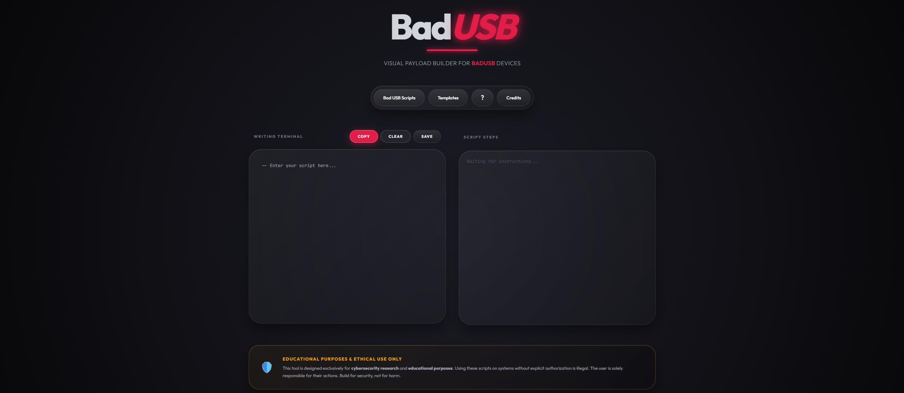

<p align="center">
    
</p>

# ⚡ BadUSB - Payload Builder

**BadUSB - Payload Builder** is a modern, responsive, and user-friendly web development environment designed to simplify the creation, learning, and deployment of **DuckyScript** scripts.

With an out-of-the-box collection of **400+ production-ready BadUSB scripts** and **60+ highly customizable blueprints/templates**, this platform enables you to craft, test, and understand complex payloads instantly.

Developed with an immersive graphical interface inspired by the world of cybersecurity, this tool is designed for both offensive security professionals conducting penetration testing audits and students looking to dissect the mechanics of keystroke injection attacks.

---
<h2>📸 Preview:</h2>

<p align="center">
    
</p>

--- 

## ✨ Advanced Features

* 🚀 **Real-Time Script Generator & Editor:** Design your payloads using a quick injection panel, or write your code directly with automatic real-time local storage (`localStorage`).
* 📚 **Script & Template Library:** Access a built-in catalog of pre-configured templates for your common audit scenarios (rapid reconnaissance, opening a reverse shell, data extraction, etc.).
* 🛡️ **Model Compatibility Matrix:** See at a glance whether your commands or scripts are compatible with the hardware you have available:
  * Hak5 USB Rubber Ducky (v1 & v2 and v3)
  * Flipper Zero
  * M5StickC / M5Stack (HID firmware)
  * Digispark ATTiny85
  * Raspberry Pi Pico / Arduino Pro Micro
* 🔍 **Step-by-Step Analyzer (Payload Deconstruction):** Visualize and understand the exact sequence of each payload. The tool breaks down the script line by line to explain the impact of each command (`DELAY`, `STRING`, `GUI r`) on the target system.
* 💾 **File Management & Export:** Built-in features to **Copy** to the clipboard, **Download** the script directly in standard `.txt` format, or **Import** your own existing creations.

---

## 🎨 Design & Ergonomics

In line with the latest visual trends, the app features:
* A deep **Dark Mode** interface with dynamic red light auras (Neon Glow).
* Components with **ultra-rounded corners** (`border-radius`) for a sleek, “capsule-like” look.
* **Precision smoothing** for hover animations, scrolling, and typographic rendering (`JetBrains Mono`).

---

## 🚀 Installation & Deployment

This project is entirely **front-end** (developed using HTML/CSS/JavaScript). It is self-contained and requires no database or backend server.

1. Clone the repository to your machine:
   ```bash
   git clone https://github.com/JustCynass/badusb_payload_builder
   ```
2. Simply open the `index.html` file in your favorite modern web browser.

3. Simply go to the Live Web 🔗`https://justcynass.github.io/badusb_payloadbuilder/`

---

## 🔒 Disclaimer

This tool is developed and made available **solely for educational purposes**, security research, and penetration testing that has been duly authorized in writing (Ethical Hacking / Pentesting). The author assumes no liability for any malicious or destructive use of the software. The user is solely responsible for complying with the laws in effect in their jurisdiction.
